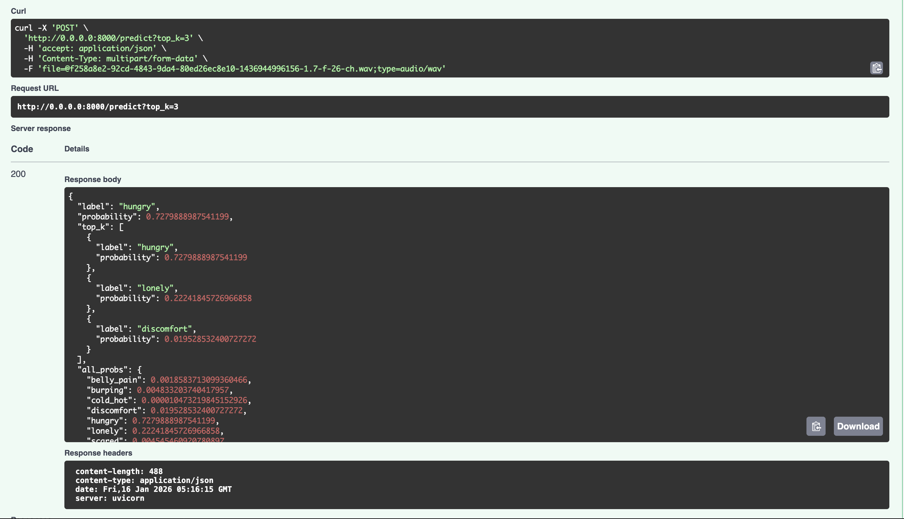

# Baby Cry Classification using CNNs

## Overview
This project implements a multi-class baby cry classification system using Convolutional Neural Networks (CNNs) trained on mel-spectrogram representations of audio signals.

The goal is to automatically classify baby cries into meaningful categories (e.g. hunger, pain, discomfort), enabling downstream applications in healthcare, parenting support tools, and intelligent assistants.

## Problem Statement
Interpreting baby cries can be challenging, especially for new parents. Different cry types may correspond to different needs such as hunger, pain, or discomfort.

This project addresses the problem of **automatically classifying baby cries** from raw audio recordings into predefined categories using deep learning. The task is framed as a **multi-class classification problem**.

Challenges include:
- High class imbalance
- Short and noisy audio samples
- Limited labeled data


## Dataset
The dataset consists of labeled baby cry audio recordings grouped into 8 distinct classes:

| Class ID | Class Name | Samples | Description |
|----------|-----------|---------|-------------|
| 0 | **belly_pain** | 16 | Cry indicating abdominal discomfort or digestive issues |
| 1 | **burping** | 18 | Cry with burping or wind-related sounds |
| 2 | **cold_hot** | 7 | Cry indicating temperature discomfort (too cold or too hot) |
| 3 | **discomfort** | 30 | General discomfort cry (wet diaper, clothing irritation, etc.) |
| 4 | **hungry** | 382 | Cry indicating hunger or feeding time |
| 5 | **lonely** | 11 | Cry indicating loneliness or need for attention/comfort |
| 6 | **scared** | 20 | Cry indicating fear or startle response |
| 7 | **tired** | 28 | Cry indicating fatigue or need for sleep |

**Total samples:** 512

Each audio file is:
- Resampled to 8 kHz
- Truncated or padded to a fixed duration (7 seconds)
- Converted into a mel-spectrogram representation

### Class Distribution

The dataset is imbalanced, with some classes significantly underrepresented. Class weighting and macro-F1 were therefore used during training and evaluation.

---

## Model Architecture

### Pipeline Overview

```
┌─────────────────────────────────────────┐
│   Raw Baby Cry Audio (8 classes)        │
└──────────────┬──────────────────────────┘
               ↓
┌─────────────────────────────────────────┐
│ Audio Preprocessing                     │
│ • Resample to 8 kHz                     │
│ • Clip/Pad to 7 seconds (56,000 samples)│
│ • Convert to mono                       │
└──────────────┬──────────────────────────┘
               ↓
┌─────────────────────────────────────────┐
│ Mel-Spectrogram Extraction              │
│ • n_mels=128, n_fft=1024, hop=256       │
│ • Convert to dB scale                   │
│ • Normalize to [0, 1]                   │
│ • Output: (128, time_steps)             │
└──────────────┬──────────────────────────┘
               ↓
┌─────────────────────────────────────────┐
│ Resize to 224×224 (ResNet input)        │
│ • Bilinear interpolation                │
│ • Replicate to 3 channels (RGB)         │
└──────────────┬──────────────────────────┘
               ↓
┌─────────────────────────────────────────┐
│ ResNet18 Backbone (ImageNet pretrained) │
│ • Frozen weights                        │
│ • Extract features (512-dim)            │
└──────────────┬──────────────────────────┘
               ↓
┌─────────────────────────────────────────┐
│ Classification Head                     │
│ • ReLU(x)                               │
│ • Dropout(0.8)                          │
│ • FC: 512 → 512                         │
│ • FC: 512 → 8                           │
│ • Softmax                               │
└──────────────┬──────────────────────────┘
               ↓
┌─────────────────────────────────────────┐
│ Output: Class Probabilities             │
│ {hungry: 0.566, discomfort: 0.391, ...} │
└─────────────────────────────────────────┘
```

### Key Design Choices

- **Backbone:** ResNet18 with ImageNet pretraining (transfer learning)
- **Input:** Mel-spectrograms resized to 224×224 with 3 channels
- **Classification Head:** 
  - Fully connected inner layer (512 units)
  - Dropout (p = 0.8) for regularization
  - Output layer with 8 classes + softmax
- **Single-channel spectrograms:** Converted to 3-channel inputs to match ResNet18 architecture

---
## Training & Evaluation
The model was trained using supervised learning with the following setup:

- **Loss function:** Cross-Entropy Loss with class weights (to handle imbalance)
- **Optimizer:** AdamW
- **Hyperparameters tested:**
  - Learning rates: 0.0001, 0.001, 0.01
  - Inner layer sizes: 64, 128, 256, 512
  - Dropout rates: 0.0, 0.5, 0.8
- **Evaluation metric:** **Macro-F1 score**
  - Chosen due to class imbalance (ensures fair evaluation across all classes)

NB: “Training uses librosa; inference uses a lightweight DSP pipeline to avoid numba/librosa runtime constraints in AWS Lambda.”

## Results
The final model achieved its best performance with the following configuration:

- Learning rate: 0.01
- Inner layer size: 512
- Dropout: 0.8

The selected checkpoint maximized macro-F1 on the validation set.

Model artifacts are versioned and available via GitHub Releases.

---
## Setup & Installation

### Prerequisites
- Python 3.9+
- pip or conda
- Docker for containerized deployment

### Local Setup

1. Clone the repository:
```bash
git clone https://github.com/blessingoraz/baby-cry-classifier.git
cd baby-cry-classifier
```

2. Create and activate virtual environment:
```bash
python -m venv .venv
source .venv/bin/activate  # On Windows: .venv\Scripts\activate
```

3. Install dependencies:
```bash
pip install -r requirements.txt
```

4. Download model artifacts from [GitHub Releases v1.0.0](https://github.com/blessingoraz/baby-cry-classifier/releases/tag/v1.0.0):
   - `best_lr_0.01_inner_512_drop_0.8.pt` → `models/checkpoints/`
   - `baby_cry_classification_resnet18.onnx` → `models/onnx/` (for ONNX inference)

## Quick Start

### 1. FastAPI Server
```bash
uvicorn src.api:app --host 0.0.0.0 --port 8000 --reload
```
Then visit `http://localhost:8000/docs`

### 2. Command Line
```bash
python scripts/test_predict.py path/to/audio.wav
```

### 3. Python Script
```python
from src.predict import predict_audio
from src.utils import format_prediction

probs = predict_audio("path/to/audio.wav")
result = format_prediction(probs, top_k=3)
print(f"Predicted: {result['label']} ({result['probability']:.2%})")
```

## Inference & Deployment

The trained model is exported to two formats:

- **PyTorch (.pt)** — used for local inference and FastAPI-based services
- **ONNX** — optimized for CPU inference and serverless deployment

### Supported deployment options
- FastAPI service (Dockerized)
- AWS Lambda using ONNX Runtime


---
## Project Structure
```
src/
  __init__.py           # Package initialization
  model.py              # CryResNet architecture and model loading
  preprocess.py         # Audio preprocessing and spectrogram generation
  predict.py            # Inference entrypoint
  api.py                # FastAPI application
  utils.py              # Helper utilities (formatting predictions)
  export_onnx.py        # ONNX model export
scripts/
  test_predict.py       # CLI script for testing predictions
notebooks/
  01_exploration.ipynb  # EDA and audio analysis
  02_preprocessing.ipynb  # Data preprocessing pipeline
  03_training.ipynb     # Model training and evaluation
data/
  raw/                  # Original labeled audio files (8 cry classes)
  processed/            # Preprocessed mel-spectrograms (not tracked in git)
  splits/               # Train/val/test split indices and label mappings
models/
  checkpoints/          # (ignored in git, PyTorch model weights)
  onnx/                 # (ignored in git, ONNX model exports)
tests/
  test_predict.py       # Unit tests for inference pipeline
  test_preprocess.py    # Unit tests for audio preprocessing
  test_utils.py         # Unit tests for formatting utilities
  test_api.py           # FastAPI endpoint integration tests
  test_predict_e2e.py   # End-to-end tests with real audio
lambda_function.py      # AWS Lambda handler for serverless deployment
```

## Docker Deployment

### Build the Docker Image

```bash
docker build -t babycry-classifier:latest .
```

### Run the Container Locally

```bash
docker run -p 8000:8000 babycry-classifier:latest
```

Then access the API at `http://localhost:8000/docs`

### Running Tests in Docker

```bash
docker run babycry-classifier:latest pytest tests/ -v
```

## AWS Deployment

### Live API Endpoint

A production instance is deployed and ready to test:

**Base URL:** `https://ikfuba8us0.execute-api.eu-north-1.amazonaws.com/default/babycry-lambda`

### Testing the Live API

Send audio file URL to the Lambda function:

```bash
curl -X POST "https://ikfuba8us0.execute-api.eu-north-1.amazonaws.com/default/babycry-lambda" \
  -H "Content-Type: application/json" \
  -d '{"url": "https://raw.githubusercontent.com/blessingoraz/baby-cry-classifier/main/data/raw/belly_pain/549a46d8-9c84-430e-ade8-97eae2bef787-1430130772174-1.7-m-48-bp.wav"}'
```

**Response Example:**

```json
{
  "belly_pain": 0.0009,
  "burping": 0.0005,
  "cold_hot": 0.0000,
  "discomfort": 0.0090,
  "hungry": 0.9873,
  "lonely": 0.0011,
  "scared": 0.0000,
  "tired": 0.0012
}
```

### Sample Audio Files

You can test with these sample files from different classes:

- **Belly Pain:** `https://raw.githubusercontent.com/blessingoraz/baby-cry-classifier/main/data/raw/belly_pain/549a46d8-9c84-430e-ade8-97eae2bef787-1430130772174-1.7-m-48-bp.wav`
- **Hungry:** `https://raw.githubusercontent.com/blessingoraz/baby-cry-classifier/main/data/raw/hungry/0c8f14a9-6999-485b-97a2-913c1cbf099c-1430760394426-1.7-m-26-hu.wav`
- **Tired:** `https://raw.githubusercontent.com/blessingoraz/baby-cry-classifier/main/data/raw/tired/7A22229D-06C2-4AAA-9674-DE5DF1906B3A-1436891944-1.1-m-72-ti.wav`

Or use any publicly accessible `.wav` file URL!

### How to Deploy Your Own

1. **Build and push Docker image to ECR:**
   ```bash
   # Authenticate with ECR
   aws ecr get-login-password --region eu-north-1 | docker login --username AWS --password-stdin YOUR_ACCOUNT.dkr.ecr.eu-north-1.amazonaws.com
   
   # Build and push (update account ID and tag)
   docker buildx build \
     --platform linux/amd64 \
     -t YOUR_ACCOUNT.dkr.ecr.eu-north-1.amazonaws.com/babycry-lambda:v1 \
     --provenance=false \
     --push \
     .
   ```

2. **Create Lambda function:**
   - AWS Lambda Console → Create Function
   - Select "Container image"
   - Point to your ECR image URI
   - Set timeout to 60 seconds (audio download + inference)
   - Allocate 1024+ MB memory

3. **Create API Gateway trigger:**
   - Add API Gateway trigger
   - Create new REST API
   - Set method to POST
   - Map requests to Lambda

4. **Test:**
   ```bash
   curl -X POST "YOUR_API_ENDPOINT" \
     -H "Content-Type: application/json" \
     -d '{"url": "https://example.com/cry.wav"}'
   ```

## API Usage

### FastAPI Interactive Docs

Once the server is running, visit: `http://localhost:8000/docs`

**Endpoints:**
- `GET /health` — Health check
- `POST /predict` — Upload audio file and get classification
  - Parameters: `file` (audio file), `top_k` (optional, default=3)
  - Returns: `label`, `probability`, `top_k`, `all_probs`

### Example cURL Request

```bash
curl -X POST "http://localhost:8000/predict" \
  -F "file=@path/to/audio.wav" \
  -F "top_k=5"
```

### Example Response

```json
{
  "label": "belly_pain",
  "probability": 0.62,
  "top_k": [
    {"label": "belly_pain", "probability": 0.62},
    {"label": "hungry", "probability": 0.21},
    {"label": "discomfort", "probability": 0.09}
  ],
  "all_probs": {
    "belly_pain": 0.62,
    "burping": 0.01,
    "cold_hot": 0.00,
    "discomfort": 0.09,
    "hungry": 0.21,
    "lonely": 0.02,
    "scared": 0.03,
    "tired": 0.02
  }
}
```

**Response Fields Explanation:**

- **`label`** — The predicted cry class with highest confidence
- **`probability`** — Confidence score for the top prediction (0.0 to 1.0)
- **`top_k`** — Array of top k predictions (default k=3, configurable via `top_k` parameter)
  - Ranked by probability in descending order
  - Useful for showing alternatives when confidence is moderate
- **`all_probs`** — Complete probability distribution across all 8 cry classes
  - Probabilities sum to 1.0 (softmax output)
  - Can be used for custom thresholding or ensemble voting
  - Very low probabilities (e.g., 0.00) indicate the model is very confident that class is not present

**Example Interpretation:**
- Model predicts **`belly_pain` with 62% confidence**
- Second best guess is **`hungry` (21%)**
- If 62% confidence is too low for your use case, you could use `top_k` results or set a custom threshold

## Unit Tests

The project includes **97 comprehensive unit and integration tests** covering:
- Audio preprocessing pipeline (`test_preprocess.py` - 24 tests)
- Inference pipeline (`test_predict.py` - 12 tests)
- Prediction formatting (`test_utils.py` - 14 tests)
- FastAPI endpoints (`test_api.py` - 30 tests)
- End-to-end integration with real audio (`test_predict_e2e.py` - 17 tests)

### Running Tests

Run all tests:
```bash
pytest
```

Run tests with verbose output:
```bash
pytest tests/ -v
```

Run a specific test file:
```bash
pytest tests/test_api.py -v
```

Run a specific test class:
```bash
pytest tests/test_api.py::TestPredictEndpoint -v
```

Run a specific test:
```bash
pytest tests/test_api.py::TestPredictEndpoint::test_predict_returns_200_with_valid_file -v
```

Run with coverage:
```bash
pytest tests/ --cov=src --cov-report=html
```


---
## Reproducibility
- All experiments were run with fixed random seeds
- Model configuration and hyperparameters are documented
- Trained artifacts are versioned via GitHub Releases

## Common Commands

```bash
# Setup
git clone https://github.com/blessingoraz/baby-cry-classifier.git
cd baby-cry-classifier
python -m venv .venv
source .venv/bin/activate
pip install -r requirements.txt

# Run tests
pytest tests/ -v
pytest tests/test_api.py::TestPredictEndpoint -v

# Start FastAPI server
uvicorn src.api:app --reload

# Test single audio file
python scripts/test_predict.py data/raw/hungry/filename.wav

# Docker
docker build -t babycry-classifier .
docker run -p 8000:8000 babycry-classifier
```


---
## Troubleshooting

**Issue: Model file not found**
- Solution: Download from [GitHub Releases](https://github.com/blessingoraz/baby-cry-classifier/releases/tag/v1.0.0) and place in `models/checkpoints/`

**Issue: Port 8000 already in use**
- Solution: Use a different port: `uvicorn src.api:app --port 8080 --reload`

**Issue: Audio file format not supported**
- Solution: Supported formats are `.wav`, `.mp3`, `.flac`, `.ogg`. Convert your file to `.wav` first.

**Issue: Tests fail with missing dependencies**
- Solution: Run `pip install -r requirements.txt` again or `pip install -r requirements.txt --upgrade`


## Demo (Screenshots)
### Local Inference


### API Demo



---
## Model Artifacts

Due to size constraints, trained model files are not stored directly in Git.

The best-performing model is available via **GitHub Releases**:

- **Release:** `v1.0.0`
- **PyTorch checkpoint:** `best_lr_0.01_inner_512_drop_0.8.pt`
- **ONNX model:** `baby_cry_classification_resnet18.onnx`

👉 Download from:  
https://github.com/blessingoraz/baby-cry-classifier/releases/tag/v1.0.0

## Limitations & Future Work

- Dataset size and imbalance limit generalization
- Real-world noise robustness can be improved
- Future improvements:
  - Larger datasets
  - Temporal models (CNN + LSTM)
  - Store model artifacts in S3 with versioning
  - Automated CI pipeline for model promotion


## References
- [Librosa: Audio analysis library](https://librosa.org/doc/latest/generated/librosa.load.html)
- [PyTorch & TorchVision](https://docs.pytorch.org/docs/stable/index.html)
- [ONNX Runtime](https://onnxruntime.ai/)
- [FastAPI: Modern async web framework](https://fastapi.tiangolo.com/)
- [Docker: Container deployment](https://www.docker.com/)

---

## Project Information

**Author:** [blessingoraz](https://github.com/blessingoraz)

**Repository:** [baby-cry-classifier](https://github.com/blessingoraz/baby-cry-classifier)

**License:** [MIT](LICENSE)

**Model Release:** [v1.0.0](https://github.com/blessingoraz/baby-cry-classifier/releases/tag/v1.0.0)

---

This project demonstrates end-to-end ML engineering practices:
- Data exploration and preprocessing
- Model training and hyperparameter tuning
- Comprehensive unit and integration testing
- Multi-format model export (PyTorch, ONNX)
- Containerization with Docker
- FastAPI REST service
- AWS Lambda deployment readiness

For questions or contributions, please open an [issue](https://github.com/blessingoraz/baby-cry-classifier/issues) or submit a [pull request](https://github.com/blessingoraz/baby-cry-classifier/pulls).
